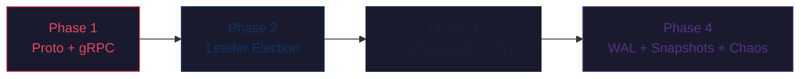

# 🏗️ Distributed Key-Value Store with Raft Consensus — Implementation Plan

> **Module:** `github.com/kuldeep-joshi/raft-kv`
> **Language:** Go 1.23+ · **Networking:** gRPC + Protobuf · **Storage:** Custom WAL + Snapshots
> **Target Cluster Size:** 3-node (dev) / 5-node (production)

---

## Project Structure (Final)

```text
raft-kv/
├── cmd/
│   ├── server/
│   │   └── main.go              # Node entrypoint: bootstrap, start Raft + gRPC
│   └── client/
│       └── main.go              # Interactive CLI client (PUT/GET/DELETE)
├── proto/
│   └── raft/
│       └── raft.proto           # Protobuf definitions (RequestVote, AppendEntries, InstallSnapshot, ClientCommand)
├── pb/
│   └── raft/
│       ├── raft.pb.go           # Generated protobuf code
│       └── raft_grpc.pb.go      # Generated gRPC stubs
├── internal/
│   ├── raft/
│   │   ├── node.go              # Core Raft node: state machine, election loop, replication loop
│   │   ├── state.go             # NodeState enum (Follower, Candidate, Leader), persistent state struct
│   │   ├── log.go               # In-memory log entries + log operations (append, truncate, match)
│   │   ├── election.go          # Election timer, RequestVote handler, vote counting
│   │   ├── replication.go       # AppendEntries handler, log replication to followers, commit tracking
│   │   ├── snapshot.go          # Snapshot trigger, InstallSnapshot handler, log compaction
│   │   └── config.go            # Raft configuration (timeouts, thresholds, peer addresses)
│   ├── storage/
│   │   ├── wal.go               # Write-Ahead Log: append entries to disk, replay on recovery
│   │   ├── snapshot_store.go    # Snapshot serialization, loading, and rotation
│   │   └── stable_store.go      # Persistent metadata (currentTerm, votedFor) via file
│   ├── kvstore/
│   │   ├── store.go             # In-memory KV map: Apply, Get, Snapshot, Restore
│   │   └── fsm.go               # FSM interface definition (the contract Raft applies commands to)
│   ├── transport/
│   │   ├── grpc_server.go       # gRPC server implementation (registers Raft service)
│   │   ├── grpc_client.go       # gRPC client pool (connections to peers)
│   │   └── interceptors.go      # Logging, metrics interceptors
│   └── cluster/
│       └── membership.go        # Static cluster membership (peer list, self ID)
├── tests/
│   ├── raft_test.go             # Unit tests for Raft core logic
│   ├── election_test.go         # Election edge cases (split vote, term collision)
│   ├── replication_test.go      # Log replication under various scenarios
│   ├── chaos_test.go            # Network partition, node crash, split-brain tests
│   └── linearizability_test.go  # Stale read detection, read-after-write guarantees
├── deployments/
│   ├── Dockerfile               # Multi-stage Go build
│   └── docker-compose.yml       # 3-node or 5-node cluster with isolated ports
├── Makefile                     # proto generation, build, test, docker targets
├── go.mod
├── go.sum
└── README.md
```

---

## Phase 1: The RPC Foundation

> **Goal:** Define the protobuf contract, generate Go code, wire up a gRPC server on each node that can ping peers.

### 1.1 — Environment Setup

| Step | Command | Notes |
|------|---------|-------|
| Install Go 1.23+ | `sudo apt install -y golang-go` or download from go.dev | Verify with `go version` |
| Install protoc | `sudo apt install -y protobuf-compiler` | Verify with `protoc --version` |
| Install Go protoc plugins | `go install google.golang.org/protobuf/cmd/protoc-gen-go@latest` | Add `~/go/bin` to PATH |
| Install Go gRPC plugin | `go install google.golang.org/grpc/cmd/protoc-gen-go-grpc@latest` | Same PATH requirement |
| Initialize module | `go mod init github.com/kuldeep-joshi/raft-kv` | In project root |

### 1.2 — Protobuf Definitions (`proto/raft/raft.proto`)

```protobuf
syntax = "proto3";
package raft;
option go_package = "github.com/kuldeep-joshi/raft-kv/pb/raft";

// ── Log Entry ──
message LogEntry {
  uint64 term    = 1;
  uint64 index   = 2;
  bytes  command  = 3;  // Serialized KV command (PUT/DELETE)
}

// ── RequestVote RPC ──
// Invoked by candidates to gather votes (§5.2 of Raft paper)
message RequestVoteRequest {
  uint64 term           = 1;  // Candidate's term
  string candidate_id   = 2;  // Candidate requesting vote
  uint64 last_log_index = 3;  // Index of candidate's last log entry
  uint64 last_log_term  = 4;  // Term of candidate's last log entry
}

message RequestVoteResponse {
  uint64 term         = 1;  // currentTerm, for candidate to update itself
  bool   vote_granted = 2;  // true = candidate received vote
}

// ── AppendEntries RPC ──
// Invoked by leader to replicate log entries; also used as heartbeat (§5.3)
message AppendEntriesRequest {
  uint64           term           = 1;  // Leader's term
  string           leader_id      = 2;  // So follower can redirect clients
  uint64           prev_log_index = 3;  // Index of log entry immediately preceding new ones
  uint64           prev_log_term  = 4;  // Term of prevLogIndex entry
  repeated LogEntry entries       = 5;  // Log entries to store (empty for heartbeat)
  uint64           leader_commit  = 6;  // Leader's commitIndex
}

message AppendEntriesResponse {
  uint64 term    = 1;  // currentTerm, for leader to update itself
  bool   success = 2;  // true if follower contained entry matching prevLogIndex/prevLogTerm
  // Optimization: conflict resolution hints
  uint64 conflict_index = 3;  // First index of the conflicting term (0 if no conflict)
  uint64 conflict_term  = 4;  // Term of the conflicting entry (0 if log is too short)
}

// ── InstallSnapshot RPC ──
// Invoked by leader to send snapshot chunks to far-behind followers (§7)
message InstallSnapshotRequest {
  uint64 term                = 1;
  string leader_id           = 2;
  uint64 last_included_index = 3;  // Last log index included in snapshot
  uint64 last_included_term  = 4;  // Term of lastIncludedIndex
  bytes  data                = 5;  // Raw snapshot bytes (full state machine dump)
}

message InstallSnapshotResponse {
  uint64 term = 1;  // currentTerm, for leader to update itself
}

// ── Client-Facing KV Operations ──
message PutRequest {
  string key   = 1;
  string value = 2;
}

message GetRequest {
  string key = 1;
}

message DeleteRequest {
  string key = 1;
}

message KVResponse {
  bool   success       = 1;
  string value         = 2;  // Populated for GET
  string error_message = 3;
  string leader_hint   = 4;  // If this node isn't the leader, redirect here
}

// ── Service Definitions ──
service RaftService {
  rpc RequestVote    (RequestVoteRequest)     returns (RequestVoteResponse);
  rpc AppendEntries  (AppendEntriesRequest)   returns (AppendEntriesResponse);
  rpc InstallSnapshot(InstallSnapshotRequest) returns (InstallSnapshotResponse);
}

service KVService {
  rpc Put    (PutRequest)    returns (KVResponse);
  rpc Get    (GetRequest)    returns (KVResponse);
  rpc Delete (DeleteRequest) returns (KVResponse);
}
```

### 1.3 — Code Generation (Makefile target)

```makefile
.PHONY: proto
proto:
	protoc --go_out=. --go_opt=paths=source_relative \
	       --go-grpc_out=. --go-grpc_opt=paths=source_relative \
	       proto/raft/raft.proto
```

> **Output:** `pb/raft/raft.pb.go` and `pb/raft/raft_grpc.pb.go`

### 1.4 — gRPC Transport Layer

| File | Responsibility |
|------|---------------|
| `internal/transport/grpc_server.go` | Create `grpc.NewServer()`, register `RaftService` + `KVService`, listen on configured port |
| `internal/transport/grpc_client.go` | Connection pool to all peers; dial with `grpc.WithTransportCredentials(insecure.NewCredentials())` for dev; provide `SendRequestVote(ctx, peer, req)` and `SendAppendEntries(ctx, peer, req)` helpers |
| `internal/cluster/membership.go` | Parse peer list from config/flags: `--id=node1 --peers=node1:9001,node2:9002,node3:9003` |

### 1.5 — Basic Server Entrypoint (`cmd/server/main.go`)

```go
// Pseudocode
func main() {
    cfg := parseFlags()                    // --id, --port, --peers, --data-dir
    node := raft.NewNode(cfg)              // Create Raft node
    grpcServer := transport.NewServer(cfg) // Create gRPC server
    grpcServer.RegisterRaft(node)          // Wire Raft RPCs
    grpcServer.RegisterKV(node.KVStore())  // Wire KV RPCs
    go grpcServer.Start()                  // Start listening
    node.Run()                             // Block on Raft main loop
}
```

### 1.6 — Phase 1 Deliverables & Tests

- [ ] `protoc` generates clean Go code
- [ ] 3 nodes can start simultaneously, connect via gRPC, and log successful peer connections
- [ ] Unit test: `TestGRPCPeerPing` — each node sends a no-op AppendEntries (heartbeat) to every peer and gets a response
- [ ] All nodes start as **Followers** with term 0

---

## Phase 2: Leader Election

> **Goal:** Implement the full Follower → Candidate → Leader state machine with randomized election timeouts and quorum voting.

### 2.1 — Raft Node State (`internal/raft/state.go`)

```go
type NodeState int
const (
    Follower  NodeState = iota
    Candidate
    Leader
)

// Persistent state (survives restarts — written to StableStore)
type PersistentState struct {
    CurrentTerm uint64
    VotedFor    string  // "" means null (hasn't voted this term)
    Log         []LogEntry
}

// Volatile state (all servers)
type VolatileState struct {
    CommitIndex uint64  // Highest log entry known to be committed
    LastApplied uint64  // Highest log entry applied to state machine
}

// Volatile state (leader only — reinitialized after election)
type LeaderState struct {
    NextIndex  map[string]uint64  // For each peer: index of next log entry to send
    MatchIndex map[string]uint64  // For each peer: highest log entry known to be replicated
}
```

### 2.2 — Election Logic (`internal/raft/election.go`)

**Algorithm (§5.2 of Raft paper):**

1. **Election timeout fires** (randomized 150–300ms) → Follower transitions to Candidate
2. Candidate increments `currentTerm`, votes for itself, resets election timer
3. Candidate sends `RequestVote` RPCs **in parallel** to all other nodes (use goroutines)
4. **Win condition:** Receives votes from a **majority** (⌊N/2⌋ + 1)
5. **Lose condition:** Receives AppendEntries from a valid leader (term ≥ currentTerm) → revert to Follower
6. **Timeout condition:** Election timeout fires again without winning → start new election

**Key safety rules:**
- Each server votes for **at most one** candidate per term (first-come-first-served)
- Voter only grants vote if candidate's log is **at least as up-to-date** as voter's log:
  - Compare `lastLogTerm` first (higher wins)
  - If equal, compare `lastLogIndex` (longer wins)

### 2.3 — Heartbeat Mechanism

Once a node becomes Leader:
- Immediately send empty `AppendEntries` (heartbeats) to all followers
- Continue sending heartbeats every **50ms** (must be << election timeout)
- If any response has `term > currentTerm` → step down to Follower

### 2.4 — The Main Raft Loop (`internal/raft/node.go`)

```go
func (n *Node) Run() {
    for {
        switch n.state {
        case Follower:
            n.runFollower()   // Block until election timeout or valid AppendEntries
        case Candidate:
            n.runCandidate()  // Run election; block until win, lose, or timeout
        case Leader:
            n.runLeader()     // Send heartbeats; replicate logs; step down if deposed
        }
    }
}
```

Each `run*` method uses `select` on Go channels + `time.Timer` for clean event-driven control flow.

### 2.5 — Phase 2 Deliverables & Tests

- [ ] `TestSingleLeaderElection`: Start 3 nodes → exactly 1 becomes leader within 2 seconds
- [ ] `TestLeaderHeartbeat`: Leader sends heartbeats; followers reset their election timers
- [ ] `TestLeaderCrashReElection`: Kill the leader → a new leader is elected within 1 second
- [ ] `TestSplitVoteRecovery`: Force a split vote → verify re-election succeeds in the next term
- [ ] `TestTermMonotonicity`: Terms only increase across the cluster; no node accepts a stale term

---

## Phase 3: Log Replication & KV Store

> **Goal:** Client sends `PUT`/`GET`/`DELETE` to the leader, which replicates to a quorum before committing.

### 3.1 — Command Flow

```
Client → PUT("x", "100") → gRPC KVService.Put()
  → Leader appends LogEntry{term, index, command=PUT x 100} to its own log
  → Leader sends AppendEntries RPC to all followers (in parallel goroutines)
  → Each follower: consistency check → append to log → respond success
  → Leader: once majority (N/2 + 1) acknowledge → update commitIndex
  → Leader: apply committed entries to KV state machine → respond to client
```

### 3.2 — AppendEntries Handler (Receiver — Follower Side)

**Algorithm (§5.3):**

1. Reply `false` if `term < currentTerm`
2. Reply `false` if log doesn't contain entry at `prevLogIndex` with `prevLogTerm`
3. If existing entry conflicts with new one (same index, different term) → delete it and all following entries
4. Append any new entries not already in the log
5. If `leaderCommit > commitIndex` → set `commitIndex = min(leaderCommit, index of last new entry)`

**Conflict optimization (not in original paper, but critical for performance):**
- On rejection, return `conflictTerm` and `conflictIndex` so the leader can skip back an entire term at a time instead of decrementing `nextIndex` one-by-one.

### 3.3 — KV State Machine (`internal/kvstore/store.go`)

```go
type KVStore struct {
    mu   sync.RWMutex
    data map[string]string
}

// Apply a committed log entry to the state machine
func (kv *KVStore) Apply(entry LogEntry) interface{} {
    cmd := decodeCommand(entry.Command)
    switch cmd.Op {
    case "PUT":
        kv.data[cmd.Key] = cmd.Value
    case "DELETE":
        delete(kv.data, cmd.Key)
    }
}

// Get reads directly from state machine (only valid on leader with linearizability check)
func (kv *KVStore) Get(key string) (string, bool) {
    kv.mu.RLock()
    defer kv.mu.RUnlock()
    val, ok := kv.data[key]
    return val, ok
}
```

### 3.4 — Linearizable Reads (ReadIndex Protocol)

To prevent stale reads when a client hits an old leader during a partition:

1. Leader receives GET request
2. Leader records its current `commitIndex` as `readIndex`
3. Leader sends heartbeat to quorum → confirms it's still leader
4. Leader waits until `lastApplied >= readIndex`
5. Leader reads from state machine and responds

> **Important:** Reads do NOT go through the log. They are served locally after confirming leadership.

### 3.5 — CLI Client (`cmd/client/main.go`)

```
$ raft-kv-client --endpoints=localhost:9001,localhost:9002,localhost:9003
> PUT name kuldeep
OK (applied at index 7, term 3)
> GET name
kuldeep
> DELETE name
OK
> GET name
(nil)
```

- Client tries each endpoint; if it gets a `leader_hint` redirect, it connects to the leader
- Retries on `UNAVAILABLE` with exponential backoff

### 3.6 — Phase 3 Deliverables & Tests

- [ ] `TestBasicPutGet`: PUT a key, GET it back → values match
- [ ] `TestReplicationToQuorum`: PUT on leader → verify entry exists in majority of nodes' logs
- [ ] `TestLeaderRedirect`: Client sends PUT to a follower → gets redirected to leader
- [ ] `TestLinearizableRead`: Partition old leader → write on new leader → read on old leader returns new value (or error)
- [ ] `TestConcurrentWrites`: 100 concurrent PUT requests → all committed in order, no data loss

---

## Phase 4: Persistence, Snapshots & Chaos Testing

> **Goal:** Crash recovery, log compaction, and adversarial testing.

### 4.1 — Write-Ahead Log (`internal/storage/wal.go`)

**Design:**
- Binary file format with CRC32 checksums per entry
- Each WAL entry: `[length:4bytes][crc:4bytes][data:N bytes]`
- On every state change (`currentTerm`, `votedFor`, or new log entry) → `fsync()` to disk
- On startup: replay WAL to reconstruct in-memory state

```go
type WAL struct {
    mu   sync.Mutex
    file *os.File
    dir  string
}

func (w *WAL) Append(entry []byte) error     // Write + fsync
func (w *WAL) ReadAll() ([][]byte, error)     // Replay from beginning
func (w *WAL) TruncateAfter(index uint64)     // Discard entries after snapshot
```

### 4.2 — Stable Store (`internal/storage/stable_store.go`)

Persists `currentTerm` and `votedFor` to a JSON file (simple, debuggable):

```json
{
  "current_term": 14,
  "voted_for": "node2"
}
```

Written atomically: write to temp file → `fsync` → `rename` (crash-safe on Linux).

### 4.3 — Snapshotting & Log Compaction (`internal/raft/snapshot.go`)

**Trigger:** When committed log length exceeds threshold (default: 1000 entries)

**Snapshot process:**
1. Lock KV store (briefly) → serialize `map[string]string` to `[]byte` (gob/JSON)
2. Record `lastIncludedIndex` and `lastIncludedTerm`
3. Write snapshot to `data-dir/snapshots/snap-{term}-{index}.dat`
4. Truncate WAL: remove all entries ≤ `lastIncludedIndex`
5. Truncate in-memory log: keep only entries after `lastIncludedIndex`

**Recovery order:**
1. Load latest snapshot → restore KV store state
2. Replay WAL entries after snapshot index → apply to KV store

**InstallSnapshot RPC (Leader → Far-Behind Follower):**
- When leader's `nextIndex[peer]` points to an already-compacted entry
- Leader sends full snapshot instead of individual entries
- Follower replaces its entire state machine + log with the snapshot

### 4.4 — Docker Compose (`deployments/docker-compose.yml`)

```yaml
services:
  node1:
    build: .
    command: ["--id=node1", "--port=9001", "--peers=node1:9001,node2:9002,node3:9003", "--data-dir=/data"]
    ports: ["9001:9001"]
    volumes: ["node1-data:/data"]
    networks: [raft-net]

  node2:
    build: .
    command: ["--id=node2", "--port=9002", "--peers=node1:9001,node2:9002,node3:9003", "--data-dir=/data"]
    ports: ["9002:9002"]
    volumes: ["node2-data:/data"]
    networks: [raft-net]

  node3:
    build: .
    command: ["--id=node3", "--port=9003", "--peers=node1:9001,node2:9002,node3:9003", "--data-dir=/data"]
    ports: ["9003:9003"]
    volumes: ["node3-data:/data"]
    networks: [raft-net]

volumes:
  node1-data:
  node2-data:
  node3-data:

networks:
  raft-net:
    driver: bridge
```

### 4.5 — Chaos Tests (`tests/chaos_test.go`)

| Test | Scenario | Expected Outcome |
|------|----------|------------------|
| `TestLeaderIsolation` | Partition the leader from all followers using a transport filter | New leader elected; old leader steps down when partition heals |
| `TestMinorityPartition` | Isolate 1 follower (minority) | Cluster continues operating; isolated node catches up after healing |
| `TestNodeCrashRecovery` | Kill a node mid-operation, restart it | Node recovers from WAL, catches up via AppendEntries, no data loss |
| `TestAllNodesRestart` | Gracefully stop all nodes, restart them | All nodes recover from disk, elect a leader, serve all previously committed data |
| `TestPacketDropUnderLoad` | Drop 30% of RPCs randomly during 1000 concurrent writes | All writes eventually committed (may take longer); no data corruption |
| `TestSplitBrainPrevention` | Partition cluster into [2] and [1] | Only the majority partition (2 nodes) can commit; minority side rejects writes |
| `TestSnapshotAndRecover` | Write 2000 entries (trigger snapshot at 1000), crash a node, restart | Node loads snapshot + replays remaining WAL; state matches cluster |

**Implementation approach:** Use a custom `Transport` interface that wraps the real gRPC transport. Chaos tests inject a `FilteredTransport` that can:
- Block all RPCs to/from specific nodes (partition simulation)
- Delay RPCs by random duration (latency injection)
- Drop RPCs with configurable probability (packet loss)

```go
type FilteredTransport struct {
    real      Transport
    mu        sync.RWMutex
    blocked   map[string]bool  // nodeID → blocked
    dropRate  float64
}

func (f *FilteredTransport) Partition(nodeID string)     // Block traffic to/from node
func (f *FilteredTransport) Heal(nodeID string)          // Restore traffic
func (f *FilteredTransport) SetDropRate(rate float64)    // Set packet drop probability
```

---

## Concurrency Model

The project makes heavy use of Go's concurrency primitives:

| Pattern | Where Used |
|---------|-----------|
| **Goroutines** | Parallel `RequestVote` sends, parallel `AppendEntries` replication, background apply loop |
| **Channels** | Event delivery (vote results, append results, commit notifications, shutdown signals) |
| **`sync.Mutex`** | Protecting Raft state (term, log, votedFor), KV store data map |
| **`sync.RWMutex`** | KV store reads (many concurrent readers, exclusive writer) |
| **`time.Timer` / `time.Ticker`** | Election timeout (randomized reset), heartbeat ticker |
| **`context.Context`** | RPC cancellation, graceful shutdown propagation |
| **`sync.WaitGroup`** | Waiting for parallel RPC responses during elections/replication |

---

## Key Design Decisions

| Decision | Rationale |
|----------|-----------|
| **Custom WAL instead of BoltDB** | Demonstrates deeper systems knowledge; more impressive on resume; full control over fsync semantics |
| **ReadIndex (not Lease Read) for linearizability** | Doesn't depend on clock synchronization; safer correctness guarantee; easier to reason about |
| **Conflict optimization in AppendEntries** | Without it, leader decrements `nextIndex` one-by-one — O(N) RPCs to fix a divergent log. With conflict hints, it's O(terms) |
| **Transport abstraction** | Enables chaos testing without Docker/iptables; tests run as pure Go unit tests in milliseconds |
| **Atomic file writes for StableStore** | `write temp → fsync → rename` pattern is crash-safe on Linux ext4/xfs |

---

## Build Order & Dependencies



| Phase | Estimated Effort | Files Created |
|-------|-----------------|---------------|
| Phase 1 | 4–6 hours | 8 files (proto, pb/*, transport/*, membership, Makefile, go.mod) |
| Phase 2 | 8–12 hours | 5 files (node, state, election, config, election_test) |
| Phase 3 | 10–15 hours | 6 files (log, replication, store, fsm, client, replication_test) |
| Phase 4 | 12–18 hours | 8 files (wal, stable_store, snapshot_store, snapshot, chaos_test, Dockerfile, docker-compose, linearizability_test) |

---

## Ready to Build?

When you're ready, say **"Let's build Phase 1"** and I'll:
1. Install Go, protoc, and the gRPC plugins
2. Initialize the module
3. Write the `.proto` file
4. Generate Go code
5. Implement the gRPC transport layer
6. Wire up the server entrypoint
7. Write and run the first test

Each phase builds on the previous — no throwaway code, no rewrites.
